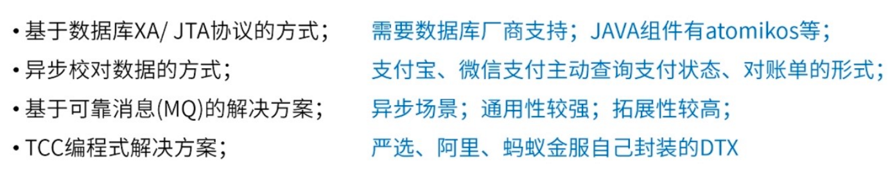

**分布式事务解决方案主要有如下4种：**

|            | 2PC      | TCC      | 可靠消息 | 最大努力通知 |
| ---------- | :------- | :------- | :-------- | :------------ |
| 一致性     | 强一致性 | 最终一致 | 最终一致 | 最终一致     |
| 吞吐量     | 低       | 中       | 高       | 高           |
| 实现复杂度 | 容易     | 难       | 中       | 容易         |

- 不同的解决方案应对不同的业务场景~
  